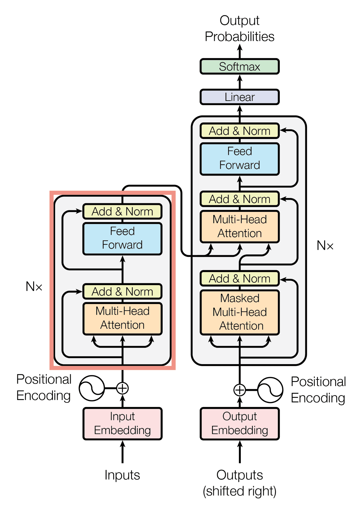

<div id="top"></div>


<br />
<div align="center">
  <a href="https://github.com/MNourbakhsh75/NN_CA5">
    
  </a>

  <h3 align="center">BERT Implementation</h3>

  <p align="center">
    Neural Networks Course Assignment - Fall 2022 - University of Tehran
    
</div>


<!-- TABLE OF CONTENTS -->
<details>
  <summary>Table of Contents</summary>
  <ol>
    <li>
      <a href="#about-the-project">About The Project</a>
    </li>
    <li>
      <a href="#built-with">Built With</a>
    </li>
    <li><a href="#useful-links">Useful Links</a></li>
    <li><a href="#contact">Contact</a></li>
  </ol>
</details>


<!-- ABOUT THE PROJECT -->
## About The Project


BERT implementation involved constructing Transformer components (encoder, multi-head attention) from scratch to grasp their core functionality. This included developing Segment, Token, and Position Embeddings. Additionally, an Attention Visualizer was crafted using the BertViz library. The dataset used for training is the IMDB movie reviews dataset which is available in <a href="https://www.kaggle.com/datasets/lakshmi25npathi/imdb-dataset-of-50k-movie-reviews">this link</a>. The implementation is in <a href="https://github.com/MNourbakhsh75/NN_CA5/blob/main/transformer.ipynb">```transformer.ipynb```</a>

[](https://colab.research.google.com/drive/14VSab5Ku4NaQl2FsE6Ak6q-NTJ6NC3Tq?usp=sharing)

## Built With

The programming language, frameworks, and technologies used in the project are listed here:

* Python
* Tensorflow


<p align="right">(<a href="#top">back to top</a>)</p>


## Useful Links

Some useful links and tutorials about this project can be found here:

* [BertViz](https://github.com/jessevig/bertviz)

<p align="right">(<a href="#top">back to top</a>)</p>


<!-- CONTACT -->
## Contact

Mehrdad Nourbakhsh - mehrdad.nb4@gmail.com

<p align="right">(<a href="#top">back to top</a>)</p>
